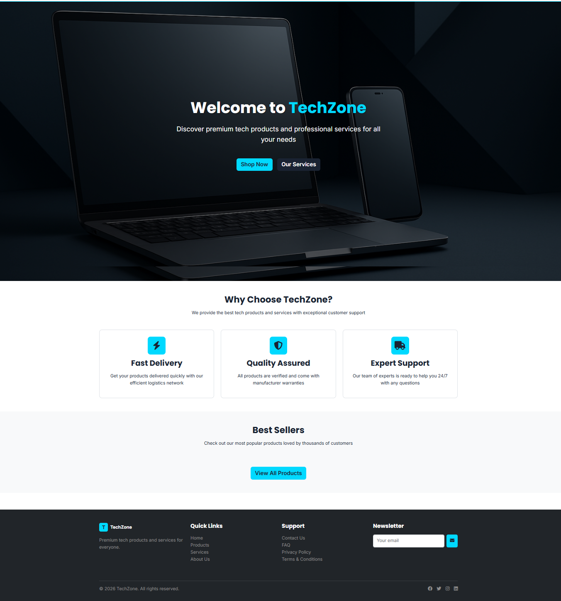
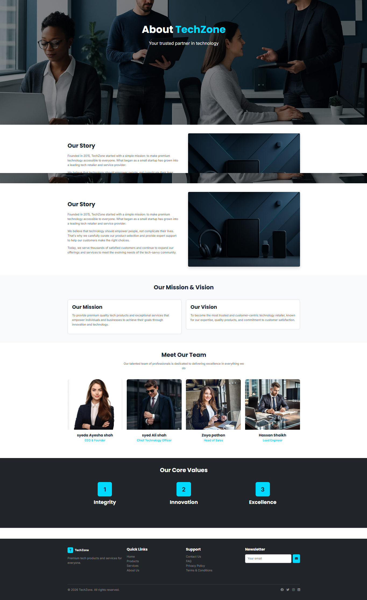
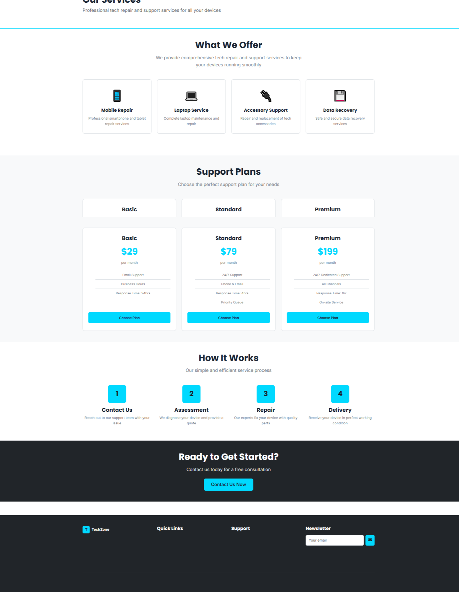
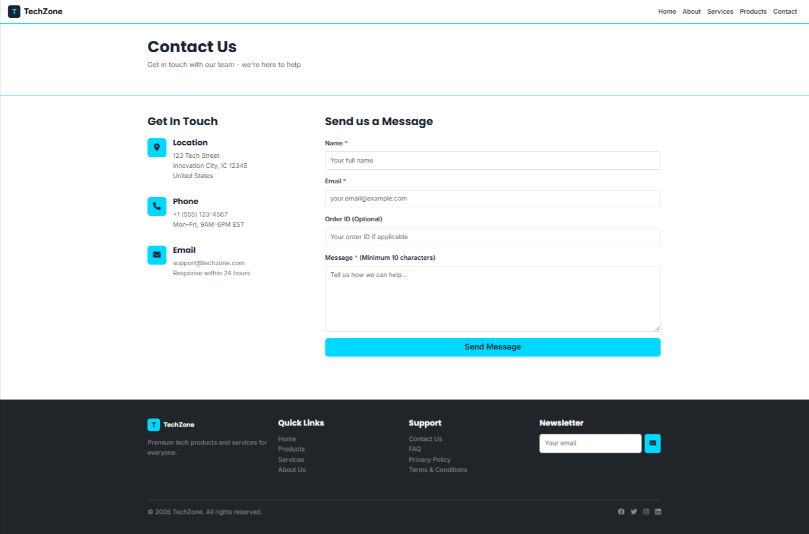

# TechZone – E-Commerce Product Showcase Website

## 📌 Project Overview
TechZone is a fully responsive E-Commerce Product Showcase website built as part of an academic assignment.  
The project demonstrates modern web design, clean UI, and core front-end logic using HTML, CSS, Bootstrap, and JavaScript.

---

## 👤 Student Information
- **Name:** Syed Ghulam Rasool Shah Lakyari  
- **Roll Number:** (WD0139)  
- **Institute:** PITP  

---

## 🛠️ Technical Track
**Track B: HTML / CSS / JavaScript**

---

## 🧩 Pages Included
1. **Home Page**
   - Hero Section with Featured Product
   - Why Choose Us Section
   - Best Sellers Grid

2. **About Us**
   - Brand Story
   - Mission & Vision
   - Team Members Cards

3. **Services**
   - Repair Services List
   - Pricing Plans (Basic, Standard, Premium)

4. **Products**
   - Product Grid (6+ Products)
   - Live Search / Filter Functionality (JavaScript)

5. **Contact**
   - Contact Form with Validation
   - Bootstrap Alert Messages
   - Store Location / Map

---

## ⚙️ Technologies Used
- HTML5  
- CSS3  
- Bootstrap 5  
- JavaScript (DOM Manipulation)

---

## 🔍 Key Features
- Fully Responsive Design
- Bootstrap Navbar with Mobile Hamburger Menu
- Dynamic Product Rendering using JavaScript
- Real-time Search Filter
- Form Validation with User Feedback
- Clean & Professional UI

---

## 📁 Folder Structure
TechZone/
│
├── index.html
├── about.html
├── services.html
├── products.html
├── contact.html
│
├── css/
│ └── style.css
│── css/
│ └── services.css
│
├── js/
│ └── script.js
│── js/
│ └── services .js
│
├── images/
│ └── (all website images)
│
└── README.
---

## 🚀 Live Preview
🔗 (Add your GitHub Pages or Vercel link here)

---

## 📸 Screenshots
- home page View 
 home page View 
  home page View 
   home page View 
    home page View 

(Add screenshots here)

---

## 📦 Deployment
- **Platform:** GitHub Pages / Vercel
- **Repository Name:** PITP_FinalTask_SyedGhulamRasool

---

## ✅ Notes
- This project follows all assignment requirements.
- Clean, readable, and well-commented code is used.
- No external backend or database is included.

---

© 2026 TechZone. All Rights Reserved.
